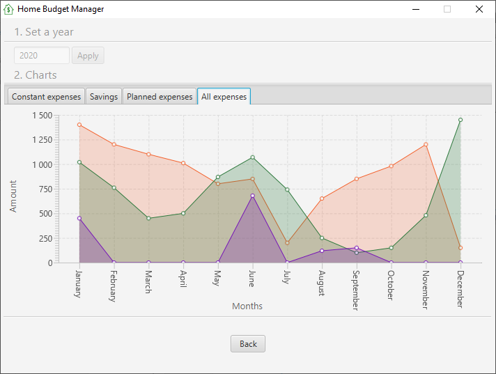

# HomeBudgetManager

1. [Project description](#description)
2. [Technologies](#technologies)
3. [Screenshots](#screenshots)

## Project description 
HomeBudgetManager is a simple desktop application that can help to manage outgoings and savings.
User can add monthly savings and constant or planned outgoings to see
charts summarizing provided data during the year.

## Technologies 
Application was created using:
- Java 8
- JavaFX 11 with SceneBuilder
- Maven

## Screenshots 

